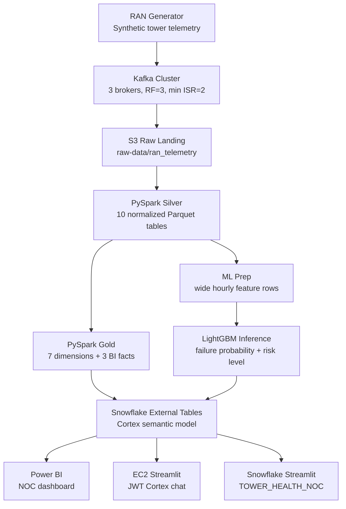
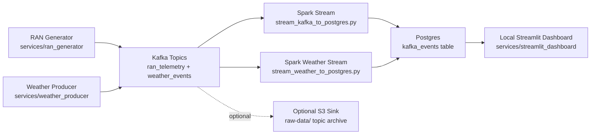

# Tower Health


Tower Health is an end-to-end telecom data engineering project for monitoring RAN tower health, alarms, radio KPIs, and predicted failure risk.

The repository includes the local streaming prototype, EC2 PySpark batch jobs, Airflow orchestration, Snowflake external-table setup, Cortex Analyst semantic model, LightGBM inference, and Streamlit NOC chat apps.

## Architecture



## Project Modules

| Module | Icon | Description |
|---|---|---|
| Streaming |  | Local Kafka-based telemetry ingestion with three brokers |
| Processing |  | Silver normalization and Gold dimensional modeling |
| Orchestration |  | EC2 DAG for Silver, Gold, ML, and Snowflake refresh |
| Warehouse |  | External tables, semantic model, Cortex Analyst |
| AI Chat |  | Bilingual NOC assistant for natural-language KPI questions |
| BI |  | Dashboard for operations, alarms, reliability, and capacity |

## Repository Structure

| Path | Purpose |
|---|---|
| `services/` | Local Docker streaming prototype: RAN generator, weather producer, Spark streaming, Postgres, Streamlit dashboard |
| `airflow/dags/` | Production-style Airflow DAG for EC2 batch orchestration |
| `ml/` | EC2 Silver/Gold PySpark jobs, ML prep, S3 inference wrapper, model artifact, feature metadata |
| `cell_level_prediction/` | Training, prediction, notebooks, and local ML experiments |
| `snowflake/` | External table setup SQL, Cortex semantic model YAML, semantic model upload helper |
| `streamlit/` | EC2 Streamlit app using Snowflake JWT key-pair authentication |
| `streamlit_snowflake/` | Snowflake Streamlit app export (`TOWER_HEALTH_NOC`) |
| `docs/` | Enhanced project documentation and technical inventory |

## Local Streaming Stack

Copy the example environment file and fill in local secrets:

```powershell
Copy-Item .env.example .env
```

Start the local Kafka/Postgres/Spark/Streamlit stack:

```powershell
docker compose up -d --remove-orphans
```

Useful local URLs:

| Service | URL |
|---|---|
| Kafka UI | `http://localhost:8090` |
| Spark master UI | `http://localhost:8084` |
| Local Streamlit dashboard | `http://localhost:8501` |
| Kafka Connect REST API | `http://localhost:8083` |

### Streaming Path

The local streaming path is the real-time part of the project:



Step by step:

| Step | Component | What happens |
|---|---|---|
| 1 | `ran-generator` | Generates synthetic tower snapshots and publishes them to Kafka topic `ran_telemetry` |
| 2 | `weather-producer` | Fetches weather for tower regions and publishes events to Kafka topic `weather_events` |
| 3 | Kafka cluster | Stores the streaming messages across three brokers with replication factor 3 |
| 4 | `spark-stream` | Reads Kafka topics and writes raw event records into Postgres table `kafka_events` |
| 5 | `spark-weather` | Reads weather events separately using its own checkpoint path |
| 6 | Postgres | Keeps the latest consumed events for local validation and dashboard queries |
| 7 | Local Streamlit dashboard | Reads Postgres and shows message counts and latest events |

The two main Kafka topics are:

```text
ran_telemetry
weather_events
```

The Spark streaming jobs use checkpoint volumes:

```text
spark_ran_checkpoints
spark_weather_checkpoints
```

These checkpoints help Spark remember what Kafka offsets were already processed, so restarting the containers does not intentionally reprocess the same stream from the beginning.

### Kafka Fault Tolerance

The local Kafka stack runs three KRaft brokers:

| Broker | Internal address | Host address |
|---|---|---|
| `broker-1` | `broker-1:29092` | `localhost:9092` |
| `broker-2` | `broker-2:29092` | `localhost:9093` |
| `broker-3` | `broker-3:29092` | `localhost:9094` |

Applications inside Docker use:

```text
broker-1:29092,broker-2:29092,broker-3:29092
```

Applications running on the host can use:

```text
localhost:9092,localhost:9093,localhost:9094
```

Kafka defaults in `docker-compose.yml`:

| Setting | Value | Meaning |
|---|---:|---|
| `KAFKA_DEFAULT_REPLICATION_FACTOR` | `3` | New auto-created topics are copied to all three brokers |
| `KAFKA_MIN_INSYNC_REPLICAS` | `2` | At least two replicas must acknowledge protected writes |
| `KAFKA_OFFSETS_TOPIC_REPLICATION_FACTOR` | `3` | Consumer group offsets survive one broker outage |
| `KAFKA_TRANSACTION_STATE_LOG_REPLICATION_FACTOR` | `3` | Transaction metadata survives one broker outage |
| `KAFKA_TRANSACTION_STATE_LOG_MIN_ISR` | `2` | Transaction metadata requires two in-sync replicas |

In simple terms: a broker is a Kafka server, and a replica is a copy of topic data stored on another broker. With three brokers and replication factor 3, each topic partition can have three copies. With minimum in-sync replicas set to 2, the cluster can keep working if one broker goes down.

Verify Postgres streaming output:

```powershell
docker compose exec -T postgres psql -U towerhealth -d towerhealth -c "SELECT topic, COUNT(*) AS rows, MAX(event_time) AS latest_event FROM kafka_events GROUP BY topic ORDER BY topic;"
```

## EC2 Batch Pipeline

The verified Airflow DAG is `airflow/dags/ran_pipeline_dag.py`.

It defines this task graph:

```text
silver -> [gold, ml_prep]
ml_prep -> resolve_partition -> predict
[gold, predict] -> refresh_snowflake
```

Runtime assumptions from the EC2 backup:

| Setting | Value |
|---|---|
| Virtual environment | `/home/ubuntu/towerhealth-env312` |
| Spark jobs directory | `/opt/ml` |
| Airflow DAG ID | `ran_pipeline` |
| Schedule | Manual trigger (`schedule=None`) |
| Retries | `0` |
| S3 bucket | `tower-iti-project` |

The Snowflake refresh task reads these environment variables:

```env
SNOWFLAKE_ACCOUNT=rmb62104
SNOWFLAKE_USER=towerproject
SNOWFLAKE_PASSWORD=...
SNOWFLAKE_WAREHOUSE=COMPUTE_WH
SNOWFLAKE_DATABASE=TOWER_HEALTH_DB
SNOWFLAKE_SCHEMA=PUBLIC
```

## Snowflake

The main setup file is:

```text
snowflake/tower_health_gold_setup.sql
```

It creates:

- Parquet file format `TOWER_PARQUET_FMT`
- CSV file format `CSV_PREDICTIONS`
- 10 Parquet external tables for Gold BI outputs
- 1 CSV external table for `FACT_ML_PREDICTIONS`
- External table refresh statements

The Cortex Analyst semantic model is:

```text
snowflake/tower_health_semantic_model.yaml
```

The EC2 Streamlit app references:

```text
@TOWER_HEALTH_DB.PUBLIC.SEMANTIC_STAGE/tower_health_semantic_model.yaml
```

## Streamlit Apps

### EC2 Streamlit

Path:

```text
streamlit/tower_health_streamlit.py
```

Install app dependencies:

```bash
pip install -r streamlit/requirements.txt
```

Runtime files required on EC2:

```text
~/.streamlit/secrets.toml
/home/ubuntu/.streamlit/rsa_key.p8
```

Use `streamlit/secrets.example.toml` as the safe template.

Run:

```bash
streamlit run streamlit/tower_health_streamlit.py --server.port 8501
```

### Snowflake Streamlit

The Snowflake app export is in:

```text
streamlit_snowflake/
```

It includes:

- `snowflake.yml`
- `TOWER_HEALTH_NOC.py`
- `pyproject.toml`
- `.streamlit/config.toml`

## ML Inference

The EC2 inference files are in `ml/`.

```bash
pip install -r ml/requirements.txt
python ml/predict_s3.py \
  --input s3://tower-iti-project/gold/ran_ml_input/gold_date=YYYY-MM-DD/ \
  --output s3://tower-iti-project/gold/ran_ml_predictions/YYYY-MM-DD_predictions.csv \
  --model ml/ran_cell_model.txt \
  --meta ml/ran_cell_model_features.json
```

Prediction output columns:

```text
timestamp, site_id, cell_id, failure_probability, predicted_failure, risk_level
```

Risk labels:

| Label | Probability range |
|---|---|
| `LOW` | `< 0.30` |
| `MEDIUM` | `0.30 - 0.55` |
| `HIGH` | `0.55 - 0.75` |
| `CRITICAL` | `>= 0.75` |

## Documentation

The enhanced technical documentation is:

```text
docs/tower_health_project_v2.md
```

It includes:

- Verified EC2 Airflow DAG
- PySpark job details
- Snowflake table and semantic model mappings
- Streamlit JWT auth and Cortex API call structure
- Code inventory
- TODO markers for files that were not present in the backup, especially SQL view DDL and PBIX metadata

## Before Pushing

Check the repo:

```powershell
git status --short
git diff --check
```

Do not commit:

- `.env`
- private keys such as `.pem` or `.p8`
- Streamlit `secrets.toml`
- Airflow DB/logs/admin password files
- generated Parquet/CSV datasets

Recommended commit:

```powershell
git add .
git status --short
git commit -m "Prepare Tower Health graduation project"
git push
```
